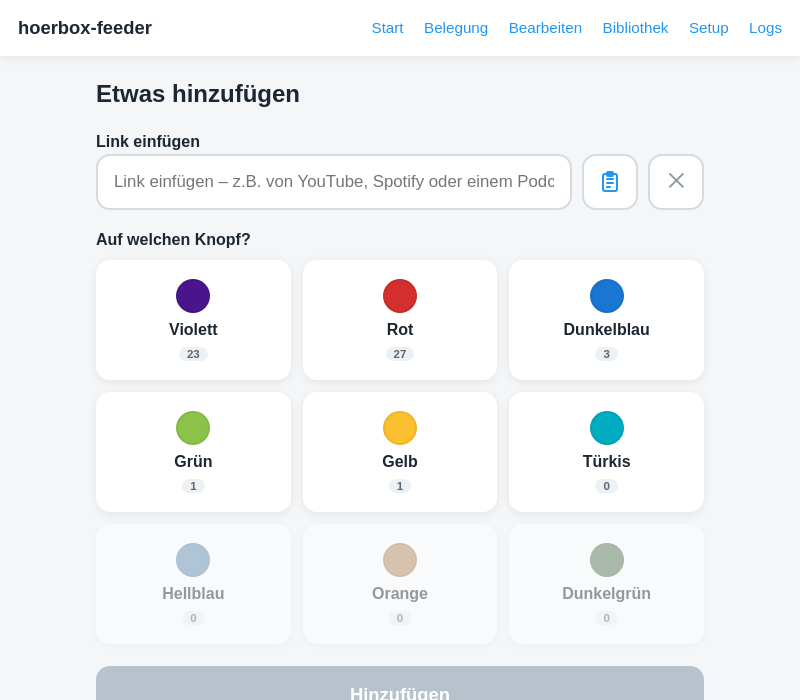
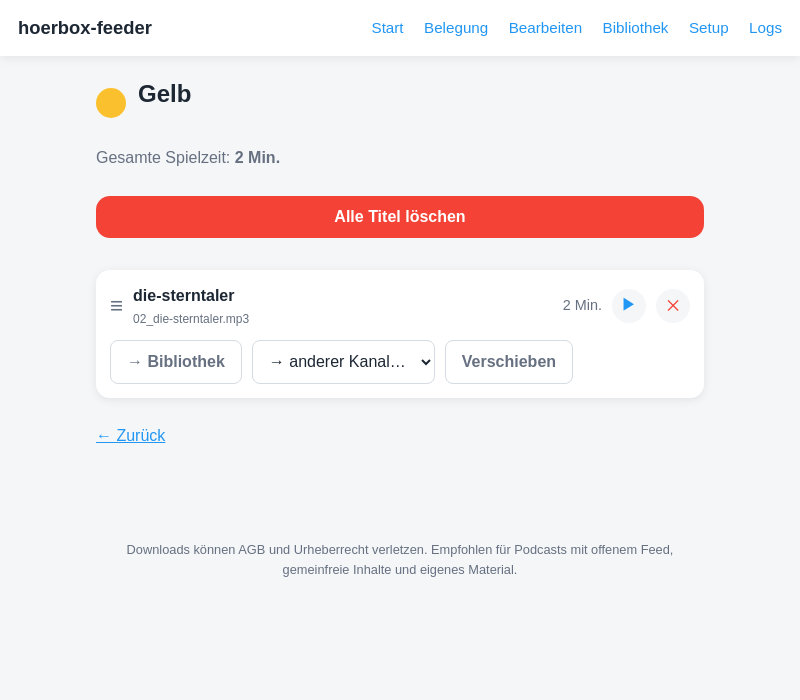

# hoerbox-feeder

*[Deutsche Version](README.md)*

[](https://github.com/kasati111/hoerbox-feeder/actions/workflows/ci.yml)
[](LICENSE)

Self-hosted web app: paste a media link in your browser (YouTube, Spotify,
podcast, ...), the server downloads the content, converts it to a
consistent, normalized MP3 format, and serves it as a podcast RSS feed –
enter the feed address once on the target device, and new episodes for
playlists/subscriptions arrive automatically after that.

This lets you manage a children's audio player automatically – **no cables,
no fiddling with SD cards, no sorting filenames**, just a browser and a
link.

<p>
  
  
</p>

*(Example content in the screenshot: "Die Sterntaler" by the Brothers Grimm,
public domain, via [vorleser.net](https://vorleser.net).)*

📖 **For parents:** a detailed, illustrated
[User Guide (PDF)](docs/USER_MANUAL.pdf) covering every feature – also
available as the [German Benutzerhandbuch (PDF)](docs/BENUTZERHANDBUCH.pdf).

## How it works

1. Paste a link, assign it to one of nine buttons.
2. hoerbox-feeder downloads the content and converts it to MP3 (normalized
   volume, embedded cover art).
3. Each button is available as its own podcast RSS feed
   (`http://<server>:8080/feed/<button>.xml`).

Since it's just a regular podcast RSS feed, hoerbox-feeder works with
**any podcast-capable device** – classic podcast apps, many
internet-connected radios, or a dedicated children's audio player.

## Background: built for the hörbert

hoerbox-feeder was developed and tested for the
[hörbert](https://www.hoerbert.com/), a wooden audio player for children
with nine colored buttons – hence the nine channels. hoerbox-feeder is an
**unofficial community project with no connection** to the hörbert's
manufacturer; the project has no business relationship with them, and it is
neither supported nor endorsed by them. It works independently of that with
any other podcast-capable device.

## Important usage notice

Downloads from streaming platforms may violate their terms of service
and/or copyright. **You are solely responsible for using hoerbox-feeder
only with content you're permitted to use** – e.g. podcasts with an open
RSS feed, public-domain content, or your own material. This project
accepts no liability for how it is used.

## Features

- Paste a link → pick a button → done. Playlists/podcasts are detected and
  automatically set up as a subscription (new episodes arrive on their
  own).
- Automatic volume normalization, cover-art embedding, audio channels
  (mono/stereo) configurable globally (Setup page).
- Language (German/English) and button display (colored buttons or
  numbered "channel buttons", for hörbert variants without colored keys)
  individually configurable (Setup page).
- Overview of storage usage per button, SD-card export as a ZIP.
- Library for parking content outside the active buttons.
- Runs entirely locally on your own network, no cloud dependency.

## For admins

This section is for the person who installs and maintains hoerbox-feeder –
not for the parents who later just paste links. For them, there's the
separate [User Guide (PDF)](docs/USER_MANUAL.pdf) – best handed over after
setup.

### Installation

```bash
git clone https://github.com/kasati111/hoerbox-feeder.git
cd hoerbox-feeder
docker compose up -d --build
```

Then open `http://<your-server-ip>:8080` in a browser.

### Update

```bash
git pull && docker compose up -d --build
```

For a deployment without Git access on the target server (tarball-based,
including rollback via `schnellstart.sh`/`update.sh`) see
[DEVELOPER.en.md § 8](DEVELOPER.en.md#8-deployment). Architecture/development
notes are there as well.

### Compatible services

- **YouTube** – single video, playlist, or entire channel (via yt-dlp).
- **Spotify** – track, album, or playlist (resolved via spotdl; the
  matching title is then searched for on YouTube and downloaded from
  there).
- **Podcasts** – any open RSS feed.
- **Direct audio downloads** – e.g. [vorleser.net](https://vorleser.net)
  (see screenshot above).
- German children's/family content that yt-dlp supports via its own
  extractors: among others **KiKA**, **ARD Audiothek**, **ARD Mediathek**,
  **ZDF** (incl. ZDFtivi).
- Beyond that, in principle much of the several hundred other sites yt-dlp
  supports.

This list is purely technical (what yt-dlp can extract) – not a
recommendation. Whether a particular use is permitted depends on the
respective platform's terms of service, see
["Important usage notice"](#important-usage-notice) above.

### RSS URLs

Each of the nine buttons has its own podcast feed at
`http://<your-server-ip>:8080/feed/<button-id>.xml`:

| ID | Button |
|----|-------|
| 0 | Purple |
| 1 | Red |
| 2 | Dark Blue |
| 3 | Green |
| 4 | Yellow |
| 5 | Turquoise |
| 6 | Light Blue |
| 7 | Orange |
| 8 | Dark Green |

Enter these addresses once in the target device or a podcast app – see
also the "addresses" page (`/einrichtung`) in the app itself, which shows
the finished URLs (incl. QR codes) per button.

### Known limitations

- **No SSL out of the box:** hoerbox-feeder runs over plain HTTP on your
  LAN by default, with no HTTPS certificate of its own. As a result, the
  📋 paste button on the home page (browser clipboard access) may not work
  in some browsers – this isn't a malfunction, it's a browser security
  requirement (the Clipboard API is only available over HTTPS or
  `localhost`). Manual paste via Ctrl+V always works regardless. Details,
  cause, and browser-specific fixes: see
  [DEVELOPER.en.md § 13.1](DEVELOPER.en.md#131-clipboard-paste-doesnt-work-missing-https).

## License

[GPL-3.0](LICENSE) – Copyright © 2026 [kasati111](https://github.com/kasati111).

## Contact

Questions, bugs, ideas: please use [GitHub Issues](https://github.com/kasati111/hoerbox-feeder/issues).
